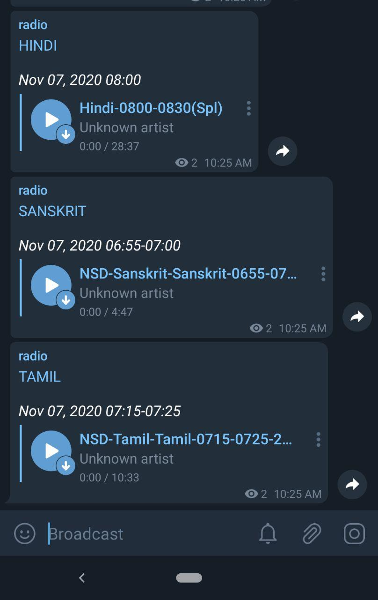

# airbot (All India Radio bot) :radio:
> telegram bot for sending today's news in audio format 

## Setup

* Requirements

    * [Telegram bot token](https://core.telegram.org/bots) 
    * Adding the bot to a public channel with admin priveleges

    

The app can be deployed in [Heroku](https://devcenter.heroku.com) or whichever platform is comfortable and set the environment variables **TOKEN** with API token and **CHANNEL** with the channel name in format `@channel`

For Heroku I am using the [scheduler addon](https://devcenter.heroku.com/articles/scheduler) to run it everyday at a specified time

> The [`config.toml`](https://github.com/neelabalan/airbot/blob/master/config.toml) file is where the preferences are set by just uncommenting or commenting the radio channels you like

## Deploy

## Screenshot

